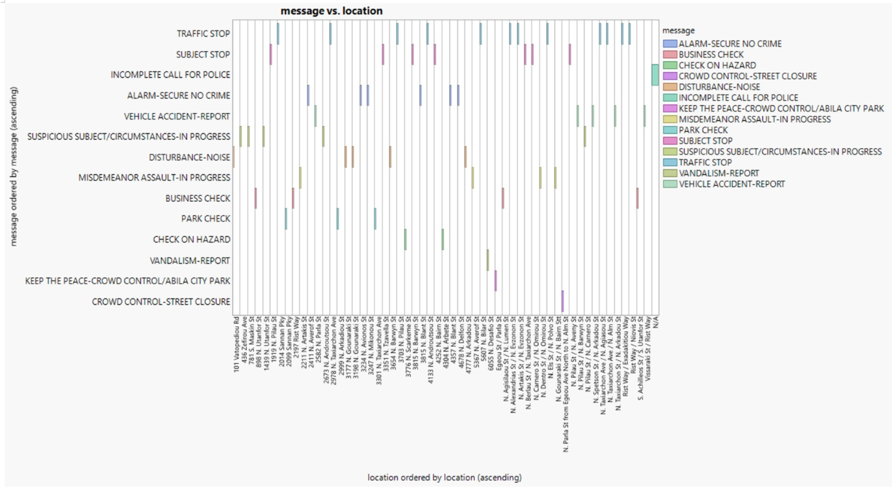
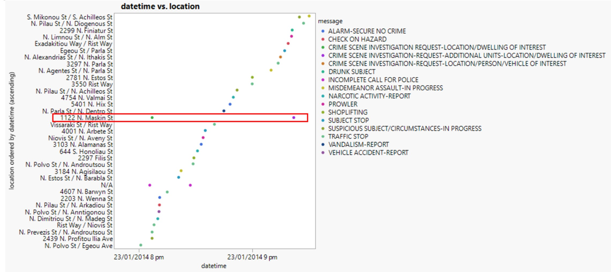
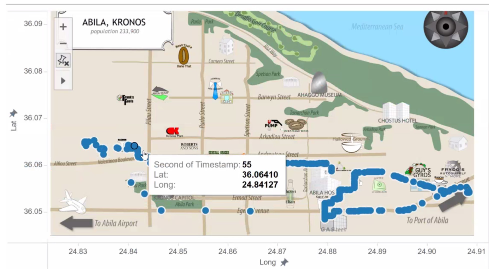
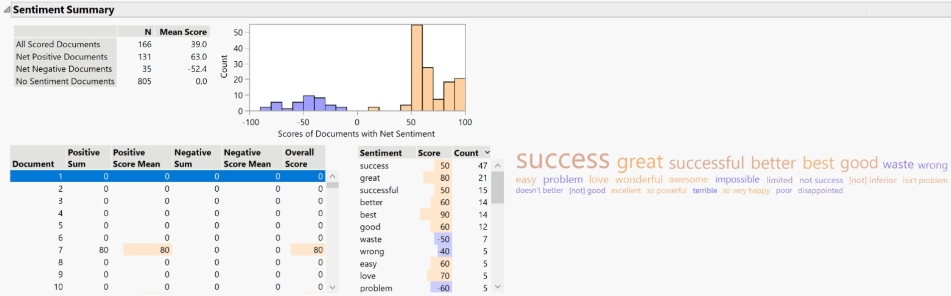

```{r setup, include=FALSE}
knitr::opts_chunk$set(echo = FALSE)
```

## 1.0 Description
The Vast Challenge is an annual competition to encourage innovation in visual analytics. This year three mini challenges are based on the previous 2014 challenges about a serious of events taking place in the fictitious country of Kronos. As the exact events and outcomes are known, our Team aims to analyse and evaluate the various methods used to uncover the events. We will also conclude based on whether the best methods will be equally successful without the advantage of hindsight. R and R Shiny will be used for this report.  


## 2.0 Motivation&Objective
* Many data analytical approaches and methods exists to solve real world problems in the areas of social networks, geospatial tracking and text analysis. While many methods can lead to the key findings, some techniques can uncover more depth and insights. We hope to showcase visualisation techniques that would be useful to uncover the important insights to solve/address the mini-challenges. 
* Objectives: To provide insightful data visualisation that address and solve the mini-challenges.  

## 3.0 Overall approach
Dashboard will have tabs for each task. Options will be given to the users to allow them to layer the techniques in order to uncover the results. A comparison with the actual events may be given as an evaluation to the techniques.  

## 4.0 Approach for individual Challenge 1
### 4.1 Mini Challenge 1
* Graphs will be created to plot similar news articles against timeline to show the order of similar documents in each important cluster as well as the relationships between primary and secondary sources through their common affiliations if any. 
* Graphs will be created to plot the clusters of new articles against their bias scores. 
* A dashboard with 2 tiers to visualize the formal relationships and shared goals in the 1st tier and the informal relationships and shared goals in the 2nd tier for GASTech, POK, APA and government


Figure1: relationship between Location and Message to show the location where most messages originate form. Graph was created using JMP Pro and will be recreated in R for the Shiny dashboard.  


### 4.2 Mini Challenge 2
* Use the 'timestamp' and  'location' field of cc_data.csv and loyalty_data.csv to infer the most popular locations(scatter plot ) as well as the daily routine(Polyline in Tableau). Then based on the common sense ,we can detect the anomalies of activities: such as it's not likely the large transactions can happen at the coffee  shop. 
* Vehicle data adds the info of employee, which can serve as the context of each transaction or location info, and can help us calibrate our suspect of the anomalies 
* Transactions are supposed to have more or less correlations with the identity of owners. 
* Based on the above  tasks completed, we can further sketch the relationship of employees through analysing the location and timestamp info.  
* Using some state of art techniques---social network analysis or graph theory. 


Figure2: Location over datetime. Graph was created using JMP Pro and will be recreated in R for the Shiny dashboard. 



Figure3: Map of Abila. Further key locations will included in R Shiny dashboard 

### 4.3 Mini Challenge 3
* How does differentiating meaningful messages improves the identification of key events? 
* Using a Task1 method to classify meaningful event reports and use the events extracted to form a timeline representing the events. Dashboard with options to select events and show the occurrences of the extracted report over time using a time series spark graph. Include the reference to key events in the timeseries to see the correlation with the word count of key terms.  
* Incorporate Task2 into the timeline allowing users to toggle between the different risk levels.  

Figure4: Sentiment analysis and Word Cloud.  R Shiny dashboard to allow for selection of sentiment and associate words.


