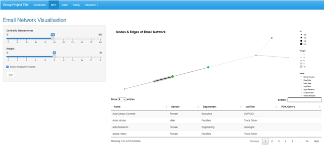
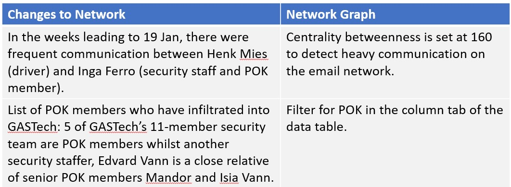
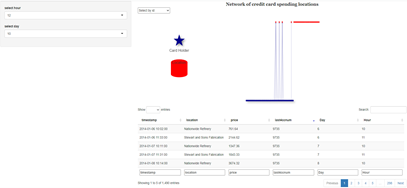
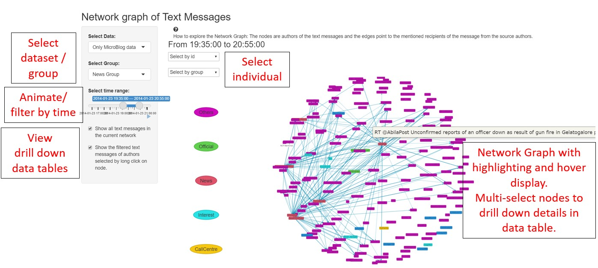
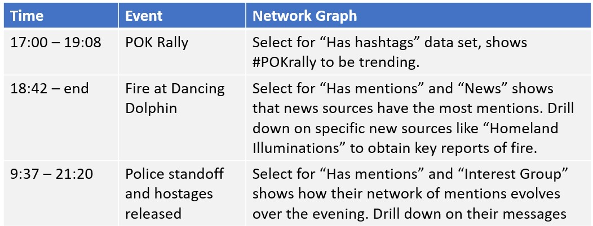

```{r setup, include=FALSE}
knitr::opts_chunk$set(echo = FALSE)
```

# Introduction
The study covers the information and events of the Kronos Incident of the VAST2021 Challenge [IEEE VAST 2021](https://vast-challenge.github.io/2021/) related to the missing GASTech employees. Data provided includes email headers, transaction records of GASTech employees' spending and short micro-blog messages and are used to piece together the series of key events related to the disappearance.     

# Issues and Approaches

The information are largely unorganized making it difficult to retrieve useful information. Given the different mediums, there was no one approach that could work for all the data sets. The high dimensionality and features makes uncovering broad trends and patterns particularly challenging.

A key feature of the data sets is that they all contain sender/ receiver information that we are keen on uncovering.For this purpose, Network Visualization is the best tool to represent such relationships. The analysis of the network can further reveal influential nodes and broad patterns and trends. Due to the sheer size of the data sets, interactive and reactive filters are incorporated into the design so that the network is not overwhelmingly cluttered for analysis. A further drill down data table is provided to explore and verify the hypothesis drawn from observations of the network.

The data sets are cleaned and transformed using the tidyverse framework. Categorical data was then transformed to binary variables for reactive filtering. Subset the dataset for key features. Create the network graph and apply further analysis methods such as centrality score calculations as required. Create the dashboard with reactive elements in R Shiny.     

# Motivation

We showcase three network visualizations to organize the information of various mediums. The proposed approach also attempts to provide a R tidy approach for network detection and visualization compared to the mostly Excel and Visio studio-based processes used in the VAST2014 Challenge on the same subject.

# Results

The application is a R-Shiny app designed for interactive network visualization of the activities of GASTech employees and communities related to the disappearance of some GASTech employees.  The network visualisation is presented in 3 parts as follows: 

## **Email communication network of GASTech employees**

The network visualization of GASTech’s email communication covers the 2 work-weeks leading to the disappearance of some of GASTech’s employees. Users select the centrality betweenness and weights of the network visualization to identify the key participants in the email network. In addition, a data table providing key information on the employees’ background is retrievable. User can further investigate employees linked to POK by using the search and filter panel of the data table to obtain their background information, such as work department, job title and POK connections.
<center>
{ width=70% }  
*Network of Email Communications*
</center>

Using the visualization, we uncovered the following:
<center>
{ width=70% }  
</center>

## **Credit Card transaction locations and records**

The network visualization of credit card transaction data covers the 2 calendar weeks to the disappearance of GASTech employees. A bipartite graph is used to visualize thecardholders and  locations of transaction as the nodes and the transactions as edges. User  can select features such as card ID, or by hour and day of the card transaction.   
<center>
{width=70% }   
*Bipartite Graph Network of Transaction spending*
</center>

A unusual gathering of GASTech employees based on their their spending location was detected by selecting the date and hour. Further inputting “Guy’s Gyros” into the location column search tab shows that 11 GASTech employees gathered from 19:45 pm to 20:51 pm on the day of GASTech employees’ disappearance.

## **Microblog communication network** 

The network graph of text messages is a collection of tweets and call center emergency dispatch records from 17:00 to 21:35 on 23rd Jan. Typical of a social network, tweets messages can contain any number of mentions, RTs, hashtags and links. These features are important as they can reveal real-time or trending information based on the "wisdom of the crowds". For example, messages with high RTs shows what the network is focused on at the moment and influential authors are those with many mentions. 
Selection of data sets by these features and filtering by groups are interactive functions that were build into the application. The Shiny application also allows for the graph to be animated, thereby allow users to view changes in the network over time. Linking the network to the data table allow users to further drill down the details of the events.
<center>
{ width=70% }   
*Network graph of Text Messages*
</center>

Key events uncovered from exploring the network are:
<center>
{ width=70% }   
*Findings from Network Analysis*
</center>

Some further observations are that spam data have no mentions or RTs. There are also a high number of spam massages with links. 

# Next Steps
The methods discussed here could be extended to other data sets such as the Twitter social media network , shopping transaction records. In our development of our application, we found these areas that could be improved upon, some were not executable due to limitations of our data sets: 
1. Allow for more centrality measures to be available for user selection as different centralities measures reveals different aspect of influential nodes in the network. 
2. Link transaction spending to a location map for more intuitive visualization of clusters of location patterns. 
3. Include followers as receiver nodes in the network for text messages so that messages with no mentions can be displayed in the network. 


# Conclusion

We have showcased three different network visualizations and showed how they can be applied to uncover insights using different data sets. Network graphs allows the presentation of vast amounts of data in an intuitive and interactive way that can speed up the process of insight discovery of the relationships and roles of key nodes of interest. 
```{r echo = FALSE, eval=FALSE}
library(pagedown)
pagedown::chrome_print("VAposter3.html")
```

